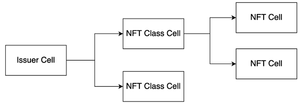

# ckb-nft-toolkit

A toolkit who provides methods to create, transfer, update and destroy issuer cells, class cells and NFT cells of Nervos CKB.

The [NFT smart contract](https://github.com/nervina-labs/ckb-nft-scripts) implement of [RFC: Multi-purpose NFT Draft Spec](https://talk.nervos.org/t/rfc-multi-purpose-nft-draft-spec/5434) is ready for [Testnet](https://github.com/nervina-labs/ckb-nft-scripts/wiki/Aggron-Testnet-deployment) and [Mainnet](https://github.com/nervina-labs/ckb-nft-scripts/wiki/Lina-Mainnet-deployment).



### Quick Start

Rename `.env.example` to `.env` and update the env variables

```
yarn install
```

Update the [example](https://github.com/duanyytop/ckb-nft-toolkit/tree/develop/src/example), select the function you want.

- [example/issuer.ts](https://github.com/duanyytop/ckb-nft-toolkit/blob/develop/src/example/issuer.ts): Create, update and destroy the issuer cell
- [example/class.ts](https://github.com/duanyytop/ckb-nft-toolkit/blob/develop/src/example/class.ts): Create, update and destroy the class cell
  - Update the class cell data with the [code](https://github.com/duanyytop/ckb-nft-toolkit/blob/develop/src/rpc/class.ts#L47-L57)
- [example/nft.ts](https://github.com/duanyytop/ckb-nft-toolkit/blob/develop/src/example/issuer.ts): Create, update, transfer and destroy the NFT cell

```
yarn start:issuer

yarn start:class

yarn start:nft
```
